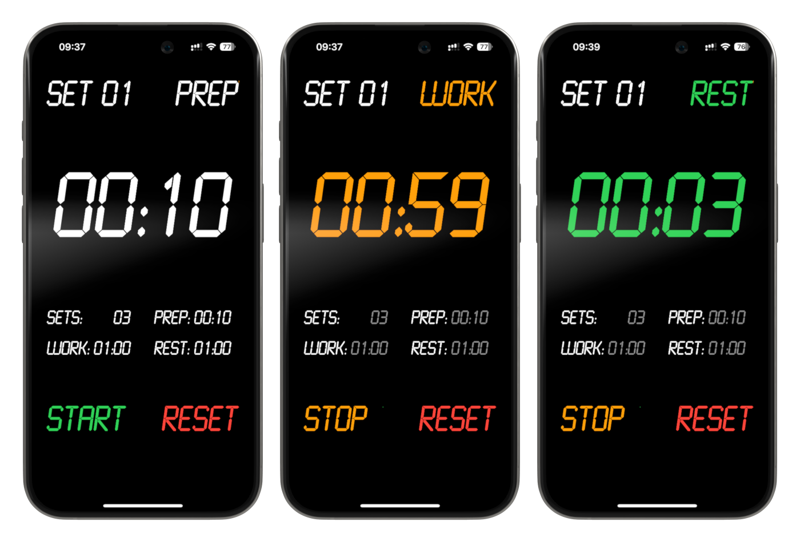

# Interval Workout Timer

A simple and lightweight, pure HTML, CSS, and JavaScript interval workout timer app.

## Screenshots

## Try It

Try it here: [http://titus-leistner.github.io/interval-timer/](http://titus-leistner.github.io/interval-timer/)

## Install on iOS

To install the app on your iOS home screen as a web app, follow these steps:

1. Open the website in Safari.
2. Tap the "Share" icon at the bottom of the screen.
3. Scroll down in the Share Sheet and select **"Add to Home Screen"**.
4. Tap **"Add"** and the app icon will be added to your home screen.

*Note:* The beep only works when the phone isn't on Silent Mode.

## Known Limitations

- The timer might not work properly when running in the background, depending on the OS and browser.

## License

This project is licensed under the MIT License - see the [LICENSE](LICENSE) file for details.

## Credits

- LCDMono font by Samuel Reynolds
